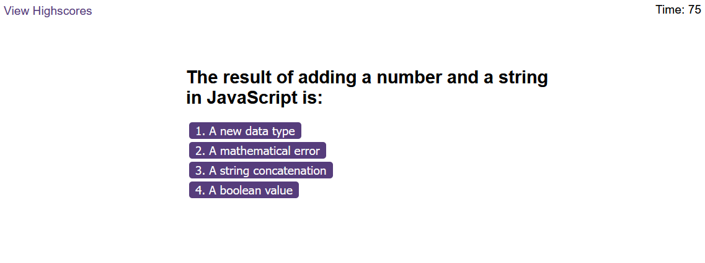

# Marcin Tatarski - Code Quiz

## Overview
This time, I've developed a dynamic and engaging coding quiz that centers around JavaScript fundamentals. The quiz incorporates responsive HTML and CSS, all driven by meticulously crafted JavaScript code. This web application comprises a blend of multiple-choice questions, offering users a valuable experience for honing their skills in coding assessments.

## Screenshot

*Interactive Code Quiz, for a seamless learning experience.*

## How to Use

1. **Commencement:**
   - Click the "Start Quiz" button to initiate the timer and display the first question.

2. **Answer Questions:**
   - Respond to each question by clicking on the appropriate multiple-choice option.

3. **Timer and Scoring:**
   - The timer will decrement by 15 second for incorrect answer.
   - Track your progress with the displayed score.

4. **Game Conclusion:**
   - The quiz concludes when all questions are answered or when the timer reaches zero.

5. **View Results:**
   - After completion, view your final score and have the option to save your initials and score.

6. **GitHub Pages Link:**
   - To experience the Code Quiz, visit the [GitHub Pages link](https://martindocs-bootcamp.github.io/mtatarski-code-quiz/).

## Credits

N/A (Open for contributions).

## License

Please refer to the [LICENSE](./LICENSE.md) file in this repository for details on how this project is licensed.